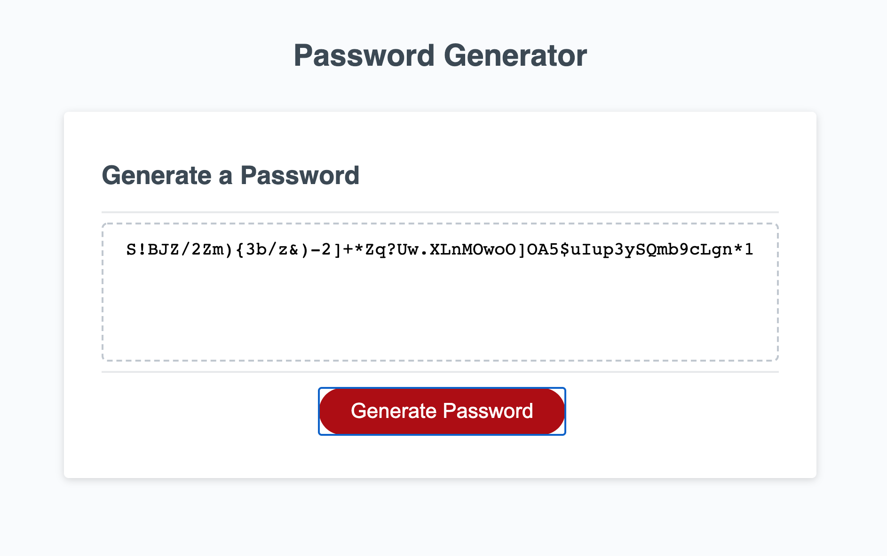

# Password Generator
## This is the readme file for a password generator application.

I built this application using HTML, CSS, Bootstrap, and JavaScript. You'll only need a browswer to make this work for you.

## How It Works
1. The user is presented with deciding the length of their password, as well as whether to include uppercase letters, lowercase letters, special characters, and/or numbers.
2. The application, after being given those parameters, generates a close-to random password for the user.

[Link to Application](https://rachelamos.github.io/password-generator/)

# Contributers:
Rachel Amos

## License & copyright

© Rachel Amos
Licensed under the [MIT License](LICENSE).